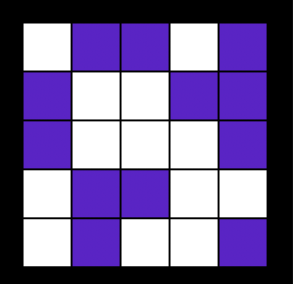
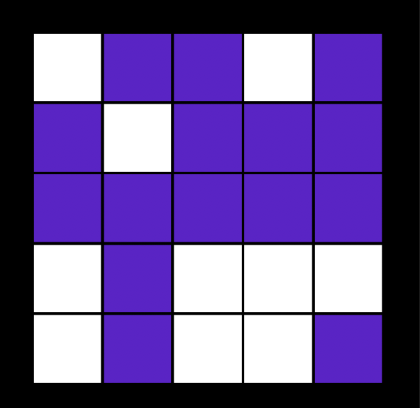
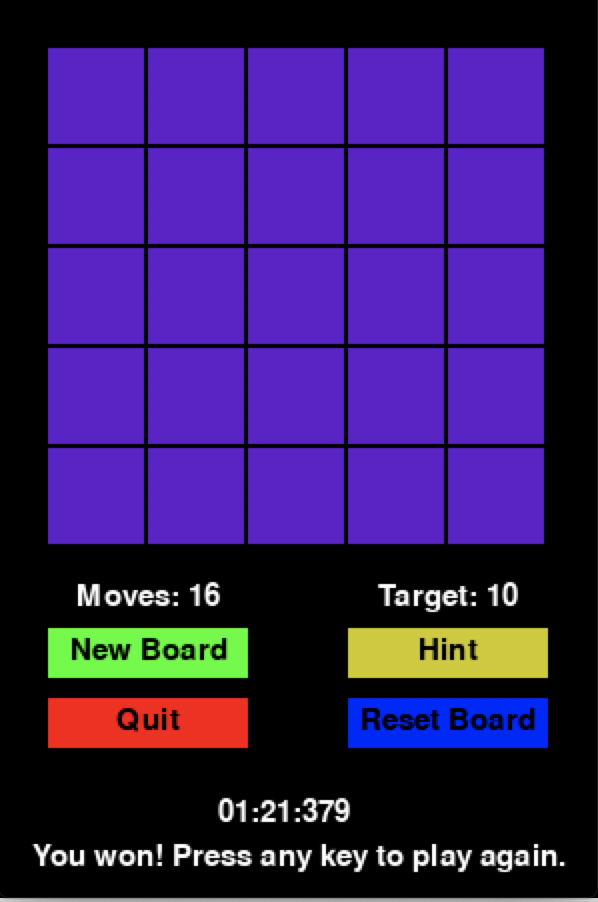

# SJSULightsOut
Lights Out game recreation for San Jose State University Math 167PS Project

Team members:

Erik Rackley, Lauren Fluty, Miriam Yee, Terry Tzeng

## Setup

### Method 1 (using browser):

* Download Anaconda from https://www.anaconda.com/
* Open Jupyter Notebook through Anaconda Navigator
* Navigate through directories using browser and open LightsOut.ipynb

### Method 2 (using terminal):


```bash
git clone https://github.com/TerryCTT/SJSULightsOut.git
cd SJSULightsOut
jupyter notebook
```
open LightsOut.ipynb and run

## How to play

The game consists of a 5x5 board which has a random number of squares lit up. 
The objective is to turn off all the lights on the game board with as few clicks as possible. 
When a user clicks a square, that square and the neighboring squares sharing an edge are switched from its current setting (on [WHITE] or off [PURPLE]) to its opposite setting. Diagonal squares do not change (example clicking middle square):\



 You win once all squares have been set to purple!\
 
